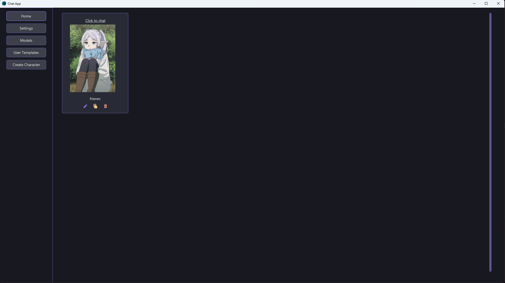
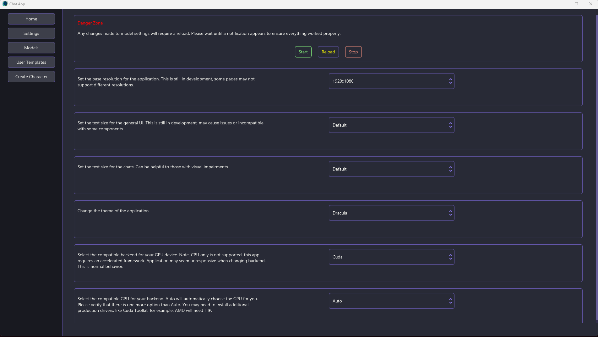
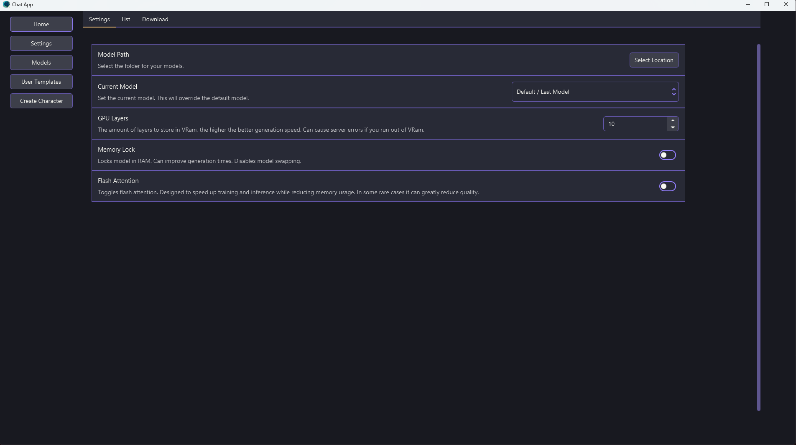
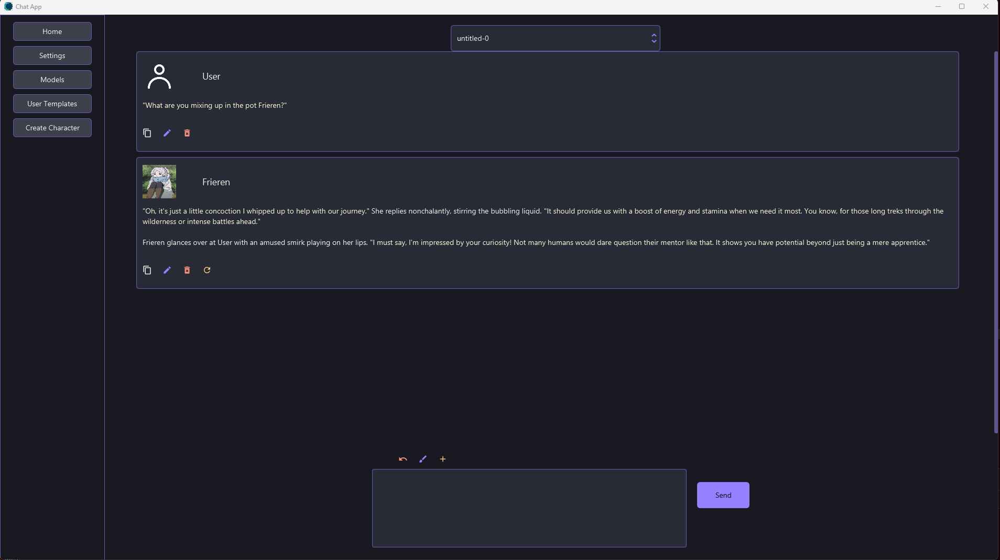

# CCA (Character Chat App)
A privacy-focused, open-source AI chat interface designed for local, private role-play and character interaction. This application leverages your local hardware to run large language models (LLMs) for immersive character experiences.

Unlike many existing solutions, this project prioritizes a fully offline and local experience. No subscriptions, no purchases, and it's completely open source.

**Important:** You'll need a mid-range gaming GPU with 8GB VRAM or more!

## Showcase

### Home
The homepage is where you can select which characters to chat with. You can also modify copy and delete characters.



### Settings
Settings page is where you can configure your device and backend. You can also modify general app settings.



### Models
Models is where you configure any model related setting. You can even download recommended models.



### Creator
The creator is where you can create and modify both characters and users.


### Chat
The chat offers basic functionality. There are controls to modify the individual messages. You can attach an image if the model supports vision.




## ✨ Features
* **Role-Play Focused:** Optimized for engaging and immersive character interactions.
* **Character Management:** Create and manage character templates, supporting imports from popular character card formats (SillyTavern, Backyard AI).
* **User Templates:** Define and customize multiple user profiles for diverse interactions.
* **Broad GPU Support:** Designed to utilize various GPUs via accelerated frameworks (CUDA, HIP, Vulkan.).
* **Open Source:** Full transparency with an open codebase for inspection and modification.
* **Privacy-Centric:**
    * **No Data Collection:** Your data stays on your machine.
    * **Encrypted Data:** Sensitive information (chats, characters, users) is encrypted locally.
* **Advanced Model Features:** Support for Qwen3 Think Mode and Jinja templating.

## 💻 Compatibility
Only works with Windows 10/11. Linux and Mac are being explored.

### Mobile
Some views are mobile supported but the application isn't. You will have to use remote desktop applications to connect to your pc remotely.

The views are extremely experimental and may not function properly.

## Code Stack
* [JavaFX](https://openjfx.io) The GUI library.
* [AtlantaFX](https://github.com/mkpaz/atlantafx) Modernized styling for JavaFX.
* [RenEngine](https://github.com/HackusatePvP/RenEngine) Simplified framework for JavaFX.
* [llama.cpp](https://github.com/ggml-org/llama.cpp) Backend server for the models.


## Multimodal / Vision
As of version 1.0.4 vision has been implemented into the chats. When sending an image it will now add the image to the chat window. You can close and expand the image when needed. The model can only process one image, it will prioritize the last sent message.

## Vulkan
Vulkan has been re-enabled as of version 1.0.1. For Nvidia 50 series and 40 series it can still bluescreen when exiting the application. Please use Cuda if you encounter a crash.

Vulkan works right out of the box. No installations needed apart from basic graphics drivers.

## 🚀 Installation

This section outlines the general steps to get you started. More detailed instructions for specific dependencies are provided in the sections that follow.

1. Download [Releases.zip](https://github.com/HackusatePvP/character-chat-app/releases).
2. (Optional) Download the updated jar if applicable.
3. (Optional) Download AI GPU drivers (Cuda, HIP)
4. Extract all files into `%APPDATA%/chat-app`
5. Enter `chat-app`
6. Run `run.bat`

## Install Application
Download the official release from [Releases](https://github.com/HackusatePvP/character-chat-app/releases)

Extract the zip file into %APPDATA%. In your Roaming folder you should see a new folder called `chat-app`

Next run the application.

1. You might be able to launch the .jar file by clicking on it like an exe. (Only works if you have java configured properly)
2. Execute `run.bat` or use the java command `java -jar {jar-name}.jar`

## Installing / Downloading Models
Only GGUF format is supported. Please refer to [Converting Models]() for converting to GGUF models.

Configure the model location in the `Models` tab on the application. It is highly recommended to change it, but you can keep it default.

If you place a model inside the directory you will have to refresh the page. (Click on `Models` tab again.)

Make sure you have a model set as a default. This is a hard requirement.

## Compile Source
You will have to have RenEngine compiled.

In the project directory run the follow.
```bash
mvnw clean install
```
There will be two jar files.
1. character-chat-app.jar : This is the executable file.
2. character-chat-app-1.0-SNAPSHOT.jar : Compiled classes only.

Place executable jar into `%APPDATA%/chat-app/`.
